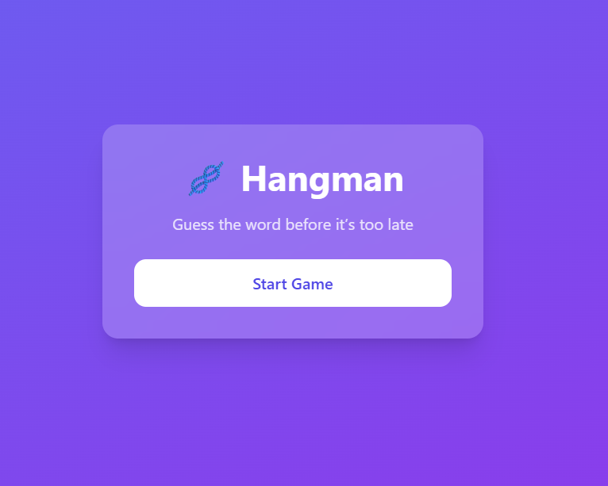
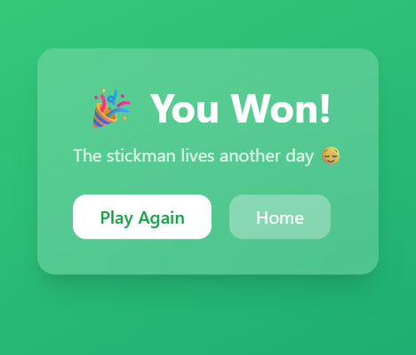

# Hangman Game 

A web-based Hangman game built using **Python (Flask)** with a clean UI and responsive design.

# Features
- Classic Hangman gameplay
- Word clues to help guessing
- Dynamic hangman drawing
- Start, Win, and Lose screens
- Mobile-friendly UI
- GitHub-integrated project

##  Tech Stack
- Python (Flask)
- HTML, CSS, JavaScript
- Tailwind CSS
- Git & GitHub

## ▶ How to Run Locally

```bash
pip install flask
python app.py

##  Screenshots

###  Start Page


###  Game Page


###  Win Page


###  Lose Page

